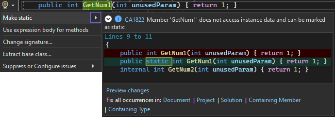
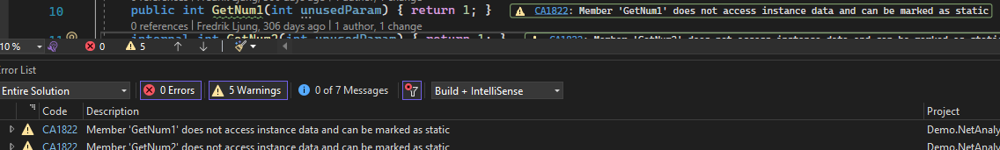

# Swetugg Göteborg 2022

This repository contains some code examples for the presentation [ANALYZE THIS: RAISE YOUR CODE QUALITY AND FOLLOW CODE STANDARDS WITH THE ROSLYN ANALYZERS](https://www.swetugg.se/gbg-2022/speakers/fredrik-ljung#analyze-this-raise-your-code-quality-and-follow-code-standards-with-the-roslyn-analyzers) at the [Swetugg Götebort 2022](https://www.swetugg.se/gbg-2022) conference (bold statement, since at time of writing it hasn't happened yet...).


## Activating the Roslyn anlyzers for .NET

the .NET analyzers are activated by default in .NET 5 and later.  To activate them for earlier versions add
```xml
<EnableNETAnalyzers>true</EnableNETAnalyzers>
```
to your projects csproj-file.


## Configuring the analyzers in csproj

By default there are only a few analyzers actively producing warnings. There are several that you can access in Visual Studio with through the ctrl + . hints. For example a [CA1822](https://docs.microsoft.com/en-us/dotnet/fundamentals/code-analysis/quality-rules/ca1822) doesn't show up as a warning but can be acted on via the hint.



What analyzers should produce warnings can be configured at a generic level by adding the ```<AnalysisLevel>``` tag to the csproj-file. The format for this is ```<level>-<mode>```. Level describes with version of .NET the analysis is at and is either ```latest```, ```preview``` or the .NET version, for instance ```5```. Mode is generic settings for which rules should produce warnings and is in increasing aggresive level ```None```, ```Default```, ```Minimum```, ```Recommended``` and ```All```. For example, to include all rules included in .NET 6 use
```xml
<AnalysisLevel>6-All</AnalysisLevel>
```

Once the above is added to the csproj-file the will instead produce an error [CA1822](https://docs.microsoft.com/en-us/dotnet/fundamentals/code-analysis/quality-rules/ca1822)



### Apply to specific code analysis category

A specific code category can be specified separately using `<AnalysisMode<Category>>`, for example
```xml
<AnalysisModeNaming>All</AnalysisModeNaming>
```
Which will turn on all Naming rules analysers.

### .NET 5

If building for .NET 5 the compounded notion above cannot be used, and the mode has to be declared in it's own element ```<AnalysisMode>```. If building with .NET 5 the above would instead be
```xml
<AnalysisLevel>5</AnalysisLevel>

<!-- Modes: AllDisabledByDefault, Default, Minimum, Recommended, AllEnabledByDefault -->
<AnalysisMode>All</AnalysisMode>
```

## Code Style

If code styles should be enforced during build set EnforceCodeStyleInBuild to true

```xml
<EnforceCodeStyleInBuild>true</EnforceCodeStyleInBuild>
```

Or if you feel the csproj shouldn't contain this info it can also be passed as an
msbuild property from command line.


```cmd
dotnet build /p:EnforceCodeStyleInBuild=true
```

Note that if you're testing this you might need to add the `--no-incremental` switch
sinc code hasn't changed.


# EditorConfig vs AnalyzerConfig, configuration files

## Difference

.editorconfig 

## Precedense - Or who wins


## Editor config

```ini
root = true

[*.{cs,vb}]

# All categories
dotnet_analyzer_diagnostic.severity = none

# Some categories
dotnet_analyzer_diagnostic.category-Naming.severity = none
dotnet_analyzer_diagnostic.category-Performance.severity = none

# The rest of the categories
dotnet_analyzer_diagnostic.category-Design.severity = none
dotnet_analyzer_diagnostic.category-Documentation.severity = none
dotnet_analyzer_diagnostic.category-Globalization.severity = none
dotnet_analyzer_diagnostic.category-Interoperability.severity = none
dotnet_analyzer_diagnostic.category-Maintainability.severity = none
dotnet_analyzer_diagnostic.category-SingleFile.severity = none
dotnet_analyzer_diagnostic.category-Reliability.severity = none
dotnet_analyzer_diagnostic.category-Security.severity = none
dotnet_analyzer_diagnostic.category-Style.severity = none
dotnet_analyzer_diagnostic.category-Usage.severity = none
dotnet_analyzer_diagnostic.category-CodeQuality.severity = none
dotnet_diagnostic.<rule>.severity = none
```


# Specific rule

Example procuding warning for missing this or me identifier for local fields, properties, methods and events

```xml
dotnet_diagnostic.IDE0009.severity = warning
dotnet_style_qualification_for_field = true
dotnet_style_qualification_for_property = true
dotnet_style_qualification_for_method = true
dotnet_style_qualification_for_event = true
```

## AnalysisConfig 

Can be any name, however .globalconfig will be implicitly added. Otherwise it has
to be explicitly set in project file with

```xml
<ItemGroup>
  <GlobalAnalyzerConfigFiles Include="<path_to_global_analyzer_config>" />
</ItemGroup>
```


### Example 


```ini
is_global = true

# dotnet_analyzer_diagnostic.severity = error
# dotnet_analyzer_diagnostic.category-Design.severity = error
# dotnet_analyzer_diagnostic.category-Documentation.severity = error
# dotnet_diagnostic.CA1303.severity = none
# dotnet_analyzer_diagnostic.category-Globalization.severity = none
# dotnet_analyzer_diagnostic.category-Interoperability.severity = error
# dotnet_analyzer_diagnostic.category-Maintainability.severity = error
# dotnet_analyzer_diagnostic.category-Naming.severity = error
# dotnet_analyzer_diagnostic.category-Performance.severity = error
# dotnet_analyzer_diagnostic.category-SingleFile.severity = error
# dotnet_analyzer_diagnostic.category-Reliability.severity = error
# dotnet_analyzer_diagnostic.category-Security.severity = error
# dotnet_analyzer_diagnostic.category-Style.severity = error
# dotnet_analyzer_diagnostic.category-Usage.severity = error
# dotnet_analyzer_diagnostic.category-CodeQuality.severity = error
# dotnet_diagnostic.IDE0060.severity = error
```

# Sources


Previously on Swetugg: https://youtu.be/9wyEARkUkXw

This is mostly pieced together from [Microsoft docs](https://docs.microsoft.com).
Examples:
https://docs.microsoft.com/en-us/dotnet/core/project-sdk/msbuild-props#enforcecodestyleinbuild
https://
